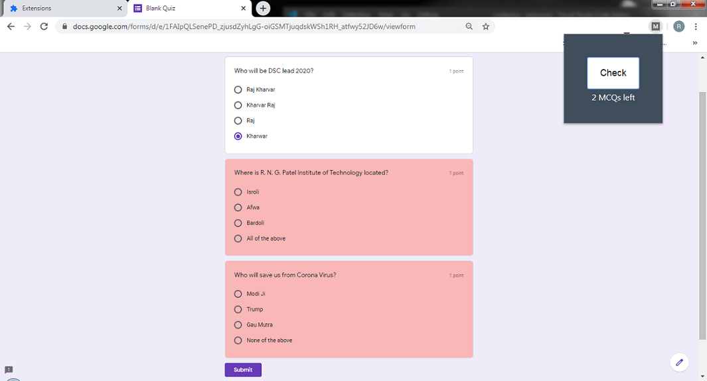

# MCQ-checker-extension

MCQ checker is a chrome extension made specifically for Google forms. It shows the number of unmarked MCQ's and highlights them.

**Step to load this extenson**  
Step 1 : Download ZIP file of this repository. 
Step 2 : visit chrome://extensions and **Enable developer mode**. 
Step 3 : Click on **Load Unpacked** and select your Unzip folder(unziped folder of this repo). 
Step 4 : The extension will be installed now.
